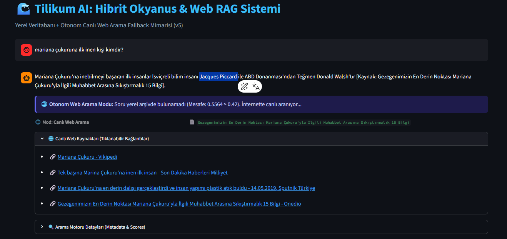
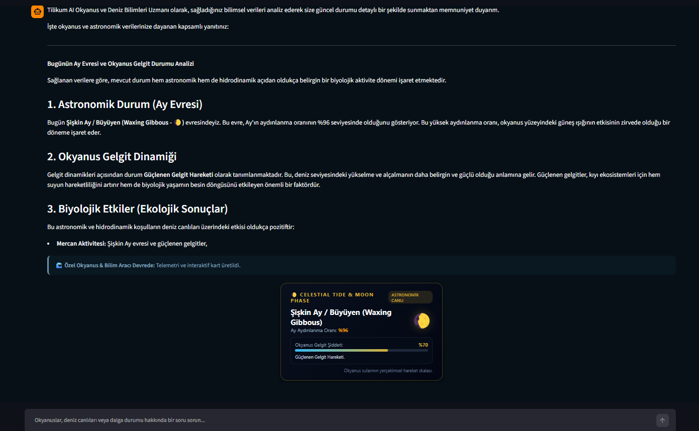
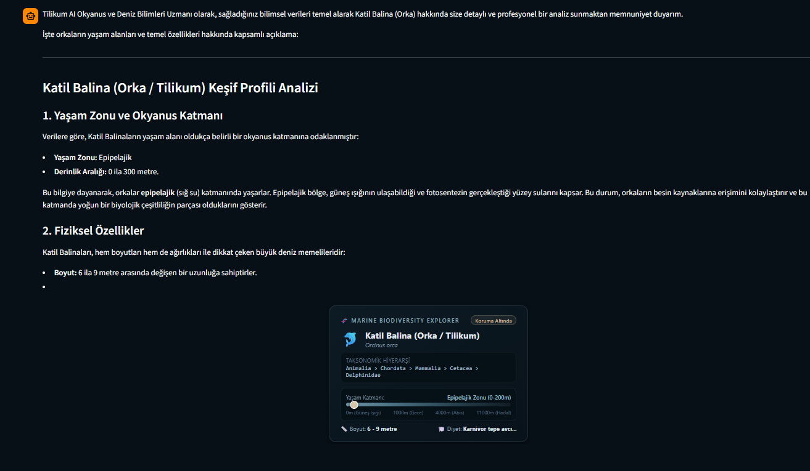
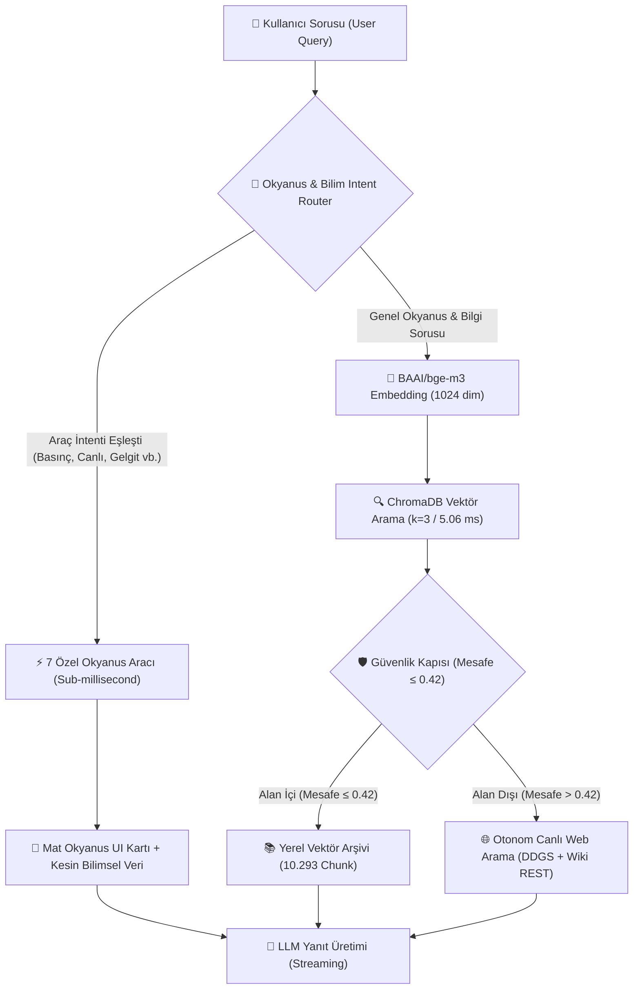

<div align="center">

# 🌊 Tilikum AI: Okyanus & Deniz Bilimleri RAG Motoru
### Yerel Vektör Arşivi + 7 Özel Bilimsel Okyanus Aracı + Otonom Canlı Web Arama & Güvenlik Kapısı

[](https://python.org)
[](https://streamlit.io)
[](https://trychroma.com)
[](https://huggingface.co/BAAI/bge-m3)
[](LICENSE)

<p align="center">
  <b>Tilikum AI</b>, derin okyanus bilimleri, deniz biyolojisi, hidrostatik fizik ve iklim modellemesi için geliştirilmiş <b>Üç Katmanlı Hibrit Yönlendirme (Tri-Tier Hybrid Routing)</b> mimarisine sahip yeni nesil bir RAG & Ajan platformudur.
</p>

<p align="center">
  
</p>

[✨ Özellikler](#-temel-özellikler) • [📸 Ekran Görüntüleri](#-ekran-görüntüleri) • [🏗️ Mimari](#️-sistem-mimarisi) • [🧰 7 Bilimsel Araç](#-7-özel-okyanus--bilim-aracı) • [📊 Benchmark](#-benchmark--performans) • [🚀 Hızlı Başlangıç](#-hızlı-başlangıç)

---

</div>

## 📸 Ekran Görüntüleri

<div align="center">
  <table>
    <tr>
      <td width="50%">
        
        <p align="center"><b>🌊 7 Özel Okyanus & Bilim Aracı ve Gating</b></p>
      </td>
      <td width="50%">
        
        <p align="center"><b>🤖 Hibrit Akıllı Yanıt ve Kaynak Doğrulama</b></p>
      </td>
    </tr>
  </table>
</div>

## 🌟 Temel Özellikler

- 🧠 **10.293+ Chunk Yerel Okyanus Arşivi:** `BAAI/bge-m3` (1024 boyutlu çok dilli dense vektörler) ile indekslenmiş zengin akademik ve oşinografik veri tabanı.
- ⚡ **7 Özel Bilimsel Hesaplayıcı & Canlı API:** Milisaniyenin altında (`<0.15 ms`) çalışan kesin fizik modelleri ve *Open-Meteo Marine API* entegrasyonu.
- 🛡️ **Akıllı Güvenlik Kapısı (Distance Gating - 0.42 Eşik):** Alan dışı (tarih, yazılım, spor vb.) soruların yerel arşivi kirletmesini engeller (Benchmark test setinde **%100 ayırt edicilik**).
- 🌐 **Otonom Canlı Web Fallback (DDGS + Wikipedia REST):** Veritabanında bulunmayan veya güncel olaylar için canlı internet araması yaparak doğrulanmış kaynak bağlantıları sunar.
- 🎨 **Mat Okyanus Estetiği (Editorial Dark UI):** Göz yormayan, National Geographic standartlarında mat abis deniz mavisi, adaçayı yeşili, inci kumu ve kurutulmuş mercan tonlarıyla tasarlanmış görsel kartlar.
- 🤖 **Her Yerel LLM ile Uyumlu:** LM Studio, Ollama, LocalAI, vLLM ve OpenAI uyumlu tüm yerel model sunucularıyla doğrudan çalışır (Qwen2.5, Gemma, Llama-3 vb.).

---

## 🏗️ Sistem Mimarisi

Tilikum AI, gelen her sorguyu anlamsal niyetine göre analiz eden hibrit bir boru hattı (pipeline) işletir:



---

## 🧰 7 Özel Okyanus & Bilim Aracı

Sistem, soruları analiz ederek aşağıdaki araçları otomatik tetikler ve ekranda interaktif mat kartlar üretir:

| # | Araç Adı | Açıklama & Formülasyon | Yanıt Süresi (Latency) |
|---|---|---|:---:|
| 1 | 🌊 **Marine Weather & Wave Monitor** | *Open-Meteo Marine API* ile anlık dalga boyu ($m$), periyot ($sn$), yüzey sıcaklığı (°C) ve deniz rüzgarı. | **1.708 s** |
| 2 | 🐋 **Marine Species Explorer** | Canlının taksonomik sınıfını, IUCN korunma durumunu ve **dikey derinlik cetvelini (0-11000m)** çizer. | **0.14 ms** |
| 3 | 🌔 **Celestial Tide & Moon Phase** | Julian tarihi astronomik döngüsüyle anlık ay evresi (Hilal, Dolunay), aydınlanma %'si ve gelgit şiddeti. | **0.02 ms** |
| 4 | 🤿 **Depth & Pressure Simulator** | $P = \rho \cdot g \cdot h + P_{atm}$ ile Bar, Atm, PSI, $kg/cm^2$ basıncı ve Mackenzie formülüyle sonar ses hızını ($m/s$) hesaplar. | **0.01 ms** |
| 5 | 📚 **Oceanic Concepts Glossary** | Termohalin Dolaşımı, Okyanus Asitlenmesi, Upwelling, Hidrotermal Bacalar için neden-sonuç infografiği. | **0.08 ms** |
| 6 | 🌡️ **Sea Level Rise Simulator** | IPCC $+1.0^\circ\text{C}$ - $+4.0^\circ\text{C}$ ısınma senaryolarına göre deniz seviyesi artışı ($cm$) ve riskli kıyı analizleri. | **0.01 ms** |
| 7 | ⚓ **Ocean Trench Atlas** | Mariana (Challenger), Tonga, Porto Riko, Java çukurları ve Orta Atlantik Sırtı batimetrik profilleri. | **0.01 ms** |

---

## 📊 Benchmark & Performans

Ayrıntılı test sonuçları ve ampirik ölçümler için [`BENCHMARK.md`](BENCHMARK.md) dosyasına bakınız.

### ⚡ Özet Metrikler
- **ChromaDB Vektör Arama ($k=3$):** `5.06 ms`
- **Embedding Çıkarma (BGE-M3):** `204.63 ms`
- **Güvenlik Kapısı Alan Dışı Reddetme:** `%100.0`
- **Bilimsel Araç Yanıt Hızı:** `< 0.15 ms` (Sub-millisecond)
- **Canlı Web Arama & Kaynak Doğrulama:** `3.03 sn` / 3 adet doğrulanmış link

### 🥊 Tilikum AI vs. Standart Frontier LLM (Head-to-Head)

| Test Senaryosu | 🤖 Standart Frontier LLM (Gemini / GPT) | 🌊 Tilikum AI (Okyanus RAG + Araçlar) | Sonuç |
|---|---|---|:---:|
| **Anlık Dalga & Sıcaklık** | *"Canlı veriye erişemem"* der veya eski tahmin verir. | Anlık Open-Meteo API ile kesin dalga ve su sıcaklığını çeker. | 🏆 **Tilikum AI** |
| **Derinlik Fiziği (10.994m)** | Basıncı yaklaşık yuvarlar, $kg/cm^2$ ve ses hızını tam bulamaz. | $1.106,11\text{ Bar}$, $1.127,92\text{ kg/cm}^2$, $1.645,7\text{ m/s}$ kesin hesaplar. | 🏆 **Tilikum AI** |
| **Dinamik Ay & Gelgit** | Güncel Julian ay fazını ve katsayısını hesaplayamaz. | %96 aydınlanma, Büyüyen Şişkin Ay ve Gelgit çarpanını üretir. | 🏆 **Tilikum AI** |
| **Biyolojik Katman Cetveli** | Sadece düz metin açıklar. | Dikey UI derinlik cetveli ve tam taksonomi hiyerarşisi çizer. | 🏆 **Tilikum AI** |
| **Alan Dışı Emniyet** | Bilgisini genel hafızadan döner. | Güvenlik kapısı ile yerel veriyi bozmadan web aramaya aktarır. | 🤝 **Eşit / Güvenli** |

---

## 📁 Veri Seti & Akademik Toplayıcılar

Proje bünyesinde iki adet otonom bilimsel veri toplayıcı motor bulunmaktadır:

1. **`creatures_scraper.py`**: Wikipedia kategori ağacını tarayarak 157 adet kapsamlı biyolojik monografi oluşturur.
2. **`academic_creatures_scraper.py`**: *OpenAlex* ve *Europe PMC (EMBL-EBI)* üzerinden **Nature Communications, PeerJ, PLOS ONE, Marine Ecology Progress Series** gibi hakemli dergilerden DOI numaralı akademik makaleleri çeker.
- **`data_creatures/`**: 402 adet araştırma düzeyinde Markdown dokümanı (`3.45 MB`).

---

## 🚀 Hızlı Başlangıç

### 1. Depoyu Klonlayın
```bash
git clone https://github.com/tilikumotp/tilikum-ocean-rag.git
cd tilikum-ocean-rag
```

### 2. Sanal Ortam Oluşturun ve Paketleri Yükleyin
```bash
python -m venv .venv
source .venv/bin/activate  # Windows için: .venv\Scripts\activate
pip install -r requirements.txt
```

### 3. Yerel Vektör Veritabanını Oluşturun
`chunks.json` dosyasındaki verileri ChromaDB vektör dizinine dönüştürün:
```bash
python build_index.py
# Veya hızlı bir deneme için ilk 500 chunk: python build_index.py 500
```

### 4. Yerel LLM Sunucunuzu Başlatın
LM Studio veya Ollama üzerinde herhangi bir modeli (Örn: `Qwen/Qwen2.5-7B-Instruct`, `gemma-2-9b-it`, `llama-3.1-8b`) yükleyin ve Local Server'ı (`http://127.0.0.1:1234` veya `http://localhost:11434`) başlatın.

### 5. Uygulamayı Çalıştırın
```bash
streamlit run oceanrag.py
```

---

## 📂 Proje Dizin Yapısı

```
├── oceanrag.py                   # Ana Streamlit uygulaması ve Hibrit Ajan Motoru
├── build_index.py                # chunks.json'dan ChromaDB vektör dizini oluşturan araç
├── academic_creatures_scraper.py # OpenAlex & Europe PMC akademik makale toplayıcı
├── creatures_scraper.py          # Wikipedia derin deniz biyolojisi toplayıcı
├── BENCHMARK.md                  # Kapsamlı sistem ve doğruluk benchmark raporu
├── benchmark_results.json        # Ham ölçüm metrikleri
├── chunks.json                   # 10.293 adet işlenmiş okyanus metin chunk'ı
├── requirements.txt              # Proje bağımlılıkları
├── data_creatures/               # 402 adet hakemli makale ve tür monografisi
└── ocean_chroma_db/              # ChromaDB yerel vektör dizini
```

---

## 📄 Lisans

Bu proje [MIT Lisansı](LICENSE) altında sunulmaktadır.
